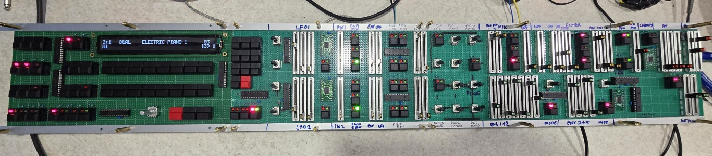

# Super-JX-10-V4-Vecoven-Editor-SysEx

I bought a reasonably cheap JX-10 internals and decided to build it into a CME UF-70 MIDI Controller with an editor to control the parameters.

The whole editor can control the JX-10 over sysex and is designed to be a new front panel for my version of the JX-10 synth, it talks to a headless JX-10 assigner board with no front panel or display attached. 

It's limitations are that the MasterTune doesn't work as I have no way to control it, neither does the Pedal button or the C1 & C2 controllers, but as you have a fully editable front panel the C1 & C2 are irrelevant and I intend to get around the pedal issue by intercepting the CME UF-70 generated pedal messages and routing them with a menu to what they need to do. I can do the same with C1 and C2 by feeding the rear socket analogue inputs into two ADC ports of the Teensy 4.1 and then assigning them to wherever I need so effectively created two foot pedal CV inputs for C1 and C2.

Plus some of the MIDI menus are no longer of use.

As yo ucould build this as a desktop module then you would still have access to MasterTune, Pedal, C1 & C2 so it would not be a concern, but as I'm building this editor into a new chassis with the JX-10 boards then its relevant.

